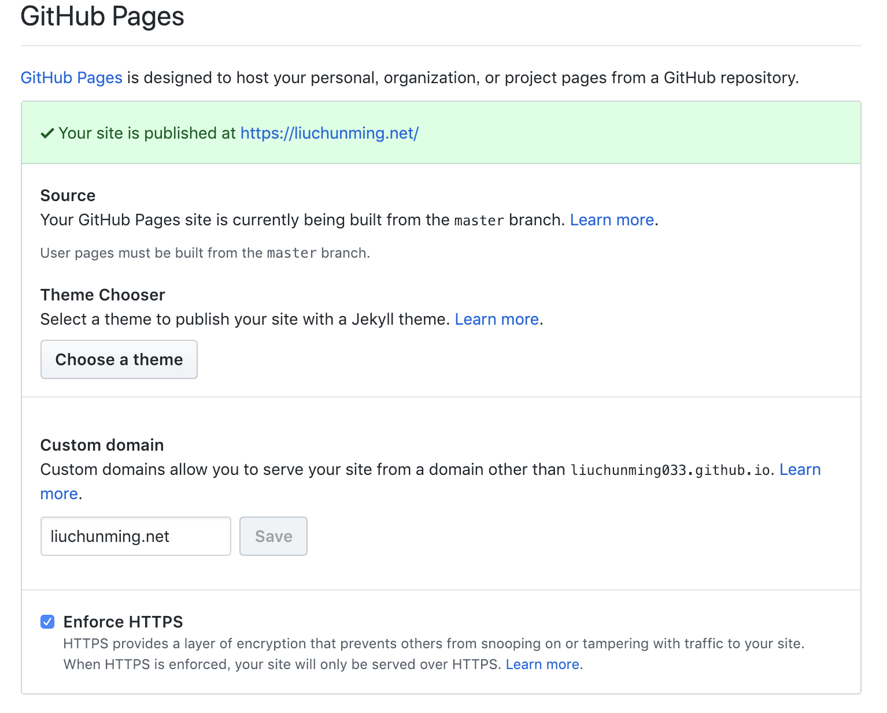

> [Hexo](https://hexo.io/zh-cn/)是一款基于Node.js的快速、简洁且高效的博客框架。具有以下几个特点：

- 超快速度： Node.js 所带来的超快生成速度，让上百个页面在几秒内瞬间完成渲染。

- 支持 Markdown： Hexo 支持 GitHub Flavored Markdown 的所有功能，甚至可以整合 Octopress 的大多数插件。

- 一键部署： 只需一条指令即可部署到 GitHub Pages, Heroku 或其他网站。

- 丰富的插件： Hexo 拥有强大的插件系统，安装插件可以让 Hexo 支持 Jade, CoffeeScript。

本篇文章带你一步一步搭建起可公网访问的博客系统。

## 安装Hexo

首先安装 Node.js 和 Git工具。因为Hexo博客依赖这两个基本的开发工具。

```shell
#For Mac
brew install node
brew install git
```

安装Hexo

```shell
npm install hexo-cli -g
```

## 快速启动一个博客
```shell
hexo init blog
cd blog
npm install
hexo server
```
接着，在浏览器中浏览http://localhost:4000，就可以看到博客了，这个博客默认一篇Hello World的博文。
这篇博文来自博客目录里面source/_posts子目录下的hello-world.md。以后我们写博文也是在这个目录下编写markdown格式的文件。

## 创建一篇自己的博文
```shell
hexo new "My New Post"
``` 
这样将会在source/_posts/目录下创建一篇博文My-New-Post.md。打开这片文章，可以看到如下的内容：
```markdown

---
title: My New Post
date: 2019-04-15 16:20:12
tags:
---
```
文章中有文章的title，有文章创建的日期，有tags（作为文章的标签，可以用于分类）。

## 让更多人看到你的博客
前面我们`hexo server`可以本地调试我们的博客站点，当发现一切OK后，我们希望将博客的站点放到网上，让更多的人看到博客里的文章。
对于个人博客而言，非常推荐部署到Github上面，因为免费，够用。

### 新建Github仓库
在自己的Github主页右上角头像旁边,选择下拉菜单中的`New repository`，给新的仓库起名字必须按照这个格式：{github账号}.github.io。
比如我的Github账号是liuchunming033，则我创建的用于部署博客的仓库名字就必须叫做liuchunming033.github.io

### 设置部署选项
将本地的文件部署（上传）到Github账户中，编辑本地Hexo目录下文件_comfig.yml，在最后添加如下代码：
```yaml
deploy:
  type: git
  repository: https://github.com/liuchunming033/liuchunming033.github.io.git
  branch: master
```
注意，把liuchunming033替换成你自己的github账户名。

### 部署博客站点到Github
在博客的根目录下，执行以下指令即可完成部署：
```shell
hexo clean && hexo generate
hexo deploy
```
这时候，在浏览器中打开http://liuchunming033.github.io网址，就可以看到你的博客站点了。是不是有点激动。
注意：`hexo deloy`依赖`hexo-deployer-git`包，需要事先通过npm安装它：
`npm install hexo-deployer-git --save`
以后我们新建博文准备发布的时候，只需要执行上面的命令就可以了。

### 配置HTTPS和自定义域名
前面我们可以通过http://liuchunming033.github.io访问我们的博客站点了。如果你有自己的域名（没有的话可以去申请一个，不贵），一定会想将博客站点解析到你的域名上。下面我们就来操作。
在Github上打开存放博客的repository，在settings页面的GitHub Pages部分，填写上你的域名即可。强烈建议将`Enforce HTTPS`勾上，这样你的博客就可以通过HTTPS访问了。
可以参考我的博客配置：


## 个性化主题
### 更换主题模板
Hexo博客提供丰富的主题模板，可以到[Hexo主题](https://hexo.io/themes/)页面挑选你喜欢的主题，比如我比较喜欢这个模板hexo-theme-huweihuang。
那么，进入到博客目录中执行下面的命令安装主题模板：
```shell
git clone https://github.com/huweihuang/hexo-theme-huweihuang.git .themes/huweihuang
```
然后到博客配置文件`_config.yml`中修改主题：
```yaml
theme: huweihuang
```
然后执行下面的命令查看一下你的博客：
```shell
hexo server
```
可以发现博客主题已经更换了。

### 边栏设置
更换完主题后，发现末模板的很多配置还是模板的作者的。我们需要按照自己的配置进行修改。我们先修改下huweihuang主题的右边栏部分。
比如头像、个性签名、边栏要展示的插件，修改 `_config.yml`如下:
```yml
# Sidebar settings
sidebar: true   # whether or not using Sidebar.
sidebar-about-description: "Stay hungry,Stay foolish"
sidebar-avatar: /img/avatar/ironman.png  # use absolute URL, seeing it's used in both `/` and `/about/`
widgets:
- featured-tags
- short-about
- recent-posts
- friends-blog
- archive
#- category
```
可以在模板的`layout/_widget`中新增新的插件。
### 评论区设置
博客添加评论功能，方便读者与作者交流。我的博客选择了一个比较简约的评论系统[Valine](https://valine.js.org/)。
想要使用Valine，必须注册LeanCloud并创建一个开发版应用（免费），注册完应用之后，就可以拿到App ID和App Key了，这两个重要的数据在下面的配置需要用到。
修改主题的配置文件 `_config.yml`如下:
```yaml
valine:
  enable: true
  app_id: {App ID}
  app_key: {App Key}
```
接着，在主题的layout/_partial/新建comments.ejs文件，内容如下：
```JavaScript
<% if(theme.valine.enable) { %>
    <div class="vcomment"></div>
    <script src="//cdn1.lncld.net/static/js/3.0.4/av-min.js"></script>
    <script src='//unpkg.com/valine@latest/dist/Valine.min.js'></script>
    <script>
        new Valine({
            el: '.vcomment',
            visitor: true,
            appId: '<%=theme.valine.app_id %>',
            appKey: '<%=theme.valine.app_key %>',
            placeholder: 'ヾﾉ≧∀≦)o发表你的高见吧, 可以留下邮箱接收评论回复的提醒哦',
            avatar: 'mm',
            pageSize: 10,
            meta: ['nick','mail'],
            notify: true
        })
    </script>
<% } %>
```
然后在需要添加评论框的页面对应的位置引用comments.ejs，比如我会在博文的底部引入评论框，所以我在主题的post.ejs中加入下面的代码：
```javascript
<!--加载valine-->
<%- partial('_partial/comments') %>
<!--加载valine-->  
```
这样，在每篇博文的底部就都有评论框了。但是我们发现评论框区域的字体实在是太小了，我们自定义CSS修改一下，在主题的source/css/中新加valine.css文件，内容如下：
```css
.v .vinput {
  font-size: 1.5rem !important;
}

.v .veditor {
  font-size: 1.5rem !important;
}

.v .vbtn {
  font-size: 1.5rem !important;
}

.v .vinfo .col {
  font-size: 1.5rem !important;
}

.v .vinfo .vcount .vnum {
  font-size: 1.5rem !important;
}

.v .power {
  display: none !important;
}

.v .vlist .vcard .vhead .vnick {
  font-size: 1.5rem !important;
}

.v .vlist .vcard .vhead .vsys {
  font-size: 1.2rem !important;
}

.v .vlist .vcard .vh .vtime {
  font-size: 1.2rem !important;
}

.v .vlist .vcard .vh .vat {
  font-size: 1.2rem !important;
}

.v .vlist .vcard .vcontent {
  font-size: 1.5rem !important;
}
```
这样看起来舒服多了。所有的评论内容都会在Leancloud的存储中看到。

### 相关文章设置
相关文章功能在博文底部展示与博文相关的文章，是个非常不错的主意，根据tag与博文匹配的多少来自动索引博客站点中的博文作为相关文章。
在主题的layout/_partial中新建recommend_posts.ejs，内容如下：
```javascript
<% var post_list = recommended_posts(page, site) %>
<% if(post_list.length > 0) { %>
    <div class="recommended_posts">
        <h2><span style="font-size:1em"><%- config['recommended_posts']['titleHtml'] %></span></h2>
        <ul>
            <% post_list.forEach(function(link) { %>
                <li><a href="<%= link.permalink %>"><%= link.title %></a></li>
            <% }) %>
        </ul>
    </div>
<% } %>
```
在博客的配置文件_config.yml中对相关文章数量、文案进行设置：
```yaml
recommended_posts:
  server: https://api.truelaurel.com #后端推荐服务器地址
  timeoutInMillis: 10000 #服务时长，超过此时长，则使用离线推荐模式
  internalLinks: 5 #内部文章数量
  externalLinks: 0 #外部文章数量
  autoDisplay: true, #自动在文章底部显示推荐文章
  titleHtml: 相关文章 #自定义标题
```
最后，在博文的模板文件中引用它，在主题中的layout/post.ejs中添加下面的部分：
```javascript
<!-- 相关文章 -->
<% if(config['recommended_posts']) { %>
<%- partial('_partial/recommend_posts', {page: page, site: site}) %>
<% } %>
```
## 总结
至此，我们的博客已经配置了侧边栏、评论区、相关文章区，并且已经可以公网访问了。下面就开始写博客内容吧~